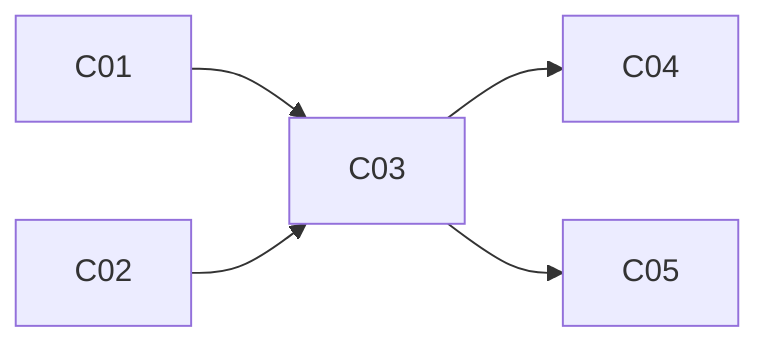

# 교재 설계 — 목차를 읽는 순서로

> **레이어: 스킬** — 어떤 순서로 하는가.
> 판단 기준(무엇을 근거로 쪼개고 합치는가)은 `~/.claude/agents/curriculum-architect.md`. 산출물 규격은 `~/.claude/orchestration/산출물-계약.md`. 문체 규약은 `~/.claude/instructions/교재-공통규약.md`.

받는 것: 목차 원문 · 독자 · 깊이 · 출력 경로 · (있으면) 원자료 경로.
쓰는 것: `00-설계/설계서.md`, `00-설계/챕터계약/NN.md` 전부.

설계자로 배정받은 작업에서만 수행한다. 메인 세션이 직접 요청을 받았다면 입력을 오케스트레이터에 넘긴다. 팀 배치·승인·단계 전환은 이 스킬의 작업이 아니다.

---

## 1단계 — 전부 읽는다

목차 전체를 읽는다. 원자료가 있으면 그것도 **전부** 읽는다. 앞부분만 보고 구조를 정하면 뒤에서 반드시 뒤집힌다.

읽으면서 두 가지를 따로 모은다.

- **구체적 수치 · 고유명사 · 경험칙 · 역사적 사실** — 나중에 계약의 「필수 포함」이 된다. 이 목록을 안 만들면 집필 단계에서 서술 흐름에 맞는 숫자만 살아남고 흐름을 깨는 숫자가 조용히 탈락한다
- **원자료가 일상 용법과 다르게 쓰는 용어** — 용어집의 첫 항목들이 된다

## 2단계 — 목차 항목을 질문으로 펼친다

각 목차 항목을 **독자가 실제로 가질 만한 질문 한 문장**으로 바꿔 적는다. 제목이 명사구면 질문으로 바꾼다.

```text
2.3 커넥션 풀    →  풀에 커넥션을 미리 만들어 두면 무엇이 빨라지는가?
2.4 풀 사이징    →  풀을 크게 잡으면 왜 오히려 느려지는가?
```

질문으로 바뀌지 않는 항목은 **내용이 없는 항목**이다. 목차 채우기용 제목이거나, 옆 항목의 일부다. 표시해 둔다.

이 목록이 설계의 작업 단위다. 이제부터 목차 제목이 아니라 **질문**을 다룬다.

## 3단계 — 의존성을 찾는다

질문마다 "이 질문에 답하려면 먼저 답해야 하는 질문"을 적는다. 답은 보통 0~2개다. 3개 이상 필요하면 그 질문이 너무 크다는 뜻이므로 쪼갠다.

여기서 **선수지식 역전**이 드러난다 — 선행 질문이 목차상 뒤에 있는 경우다. 역전은 세 가지 방법으로만 푼다.

1. 순서를 바꾼다 (가장 흔함)
2. 앞 항목에서 필요한 만큼만 미리 짧게 다룬다 — 「다루는 것」에 명시하고 소유권은 뒤 챕터에 둔다
3. 둘을 합친다

어느 방법이든 **「원래 목차에서 바꾼 것」에 기록한다.**

## 4단계 — 챕터로 묶는다

**질문 하나 = 챕터 하나**가 출발점이다. 그다음 둘로 조정한다.

- 답하는 데 15분도 안 걸리는 질문 → 가장 가까운 선행/후행 질문과 합친다
- 질문 하나인데 깊이 설정의 상한을 넘을 것 같으면 → 질문을 둘로 쪼갠다 (보통 "무엇인가"와 "어떻게 쓰는가"로 갈린다)

깊이별 챕터 크기:

| 깊이 | 읽기 시간 | 본문 분량 | 코드 예시 |
|---|---|---|---|
| 압축 | 15분 | 2,000~3,000자 | 0~1개 |
| 표준 | 25~40분 | 4,000~5,500자 | 1~2개 |
| 정밀 | 45~60분 | 6,000~8,000자 | 2~4개 |

**챕터 간 개념 도약이 있으면 연결 챕터를 추가한다.** 추가분은 전체 챕터 수의 20%를 넘기지 않는다.

## 5단계 — 소유권을 배정한다

2단계에서 만든 질문 목록을 훑어 **같은 개념을 건드리는 질문들**을 묶는다. 각 묶음마다 가장 깊이 다룰 챕터 하나를 소유자로 정한다.

나머지 챕터의 계약에는 「다루지 않는 것」에 **소유 챕터 번호와 함께** 적는다.

```markdown
## 다루지 않는 것
- 커넥션 누수 탐지 → **07장 소유**
- HikariCP 설정값 전체 목록 → **부록 A 소유**
```

번호 없는 금지 항목은 금지로 작동하지 않는다. 반드시 번호를 적는다.

## 6단계 — 관통 사례를 하나 정한다

책 전체를 관통할 사례 하나를 고른다. 고르는 기준은 **정상 · 실패 · 극단 · 복구로 변주되는가**다.

사례가 정해지면 **챕터별로 어느 장면을 쓸지 배분한다.** 배분표가 없으면 집필자들이 각자 같은 장면을 쓰거나 새 사례를 만든다.

```markdown
## 관통 사례 — 주문 조회 API
- 참여 대상: 주문 서비스 · MySQL · HikariCP
- 초기 상태: 풀 10, 평균 응답 120ms
- 03장: 풀이 다 찼을 때의 대기  |  04장: 풀을 50으로 올린 뒤의 역전  |  06장: 타임아웃 후 복구
```

## 7단계 — 용어집을 만든다

책 전체에서 통일할 표기를 정한다. `용어 | 표기 | 최초 정의 챕터` 3열.

들어가는 것: 표기가 갈릴 수 있는 용어(커넥션 풀/커넥션풀/connection pool), 원자료가 특수하게 쓰는 용어, 챕터마다 반복 등장할 핵심 용어. **모든 용어를 넣지 않는다** — 집필자가 실제로 헷갈릴 것만.

## 8단계 — 의존성 그래프와 레벨 표를 만든다

3단계 의존성을 챕터 단위로 접어 그래프로 그린다. 그다음 **레벨을 계산한다** — 선수 챕터가 없으면 레벨 0, 나머지는 `max(선수들의 레벨) + 1`.

~~~markdown
## 의존성 그래프



| 레벨 | 챕터 | 동시 집필 |
|---|---|---|
| 0 | 01, 02 | 가능 |
| 1 | 03 | — |
| 2 | 04, 05 | 가능 |
~~~

**이 표가 Phase 2 병렬 배치의 근거다.** 표가 없으면 지휘자는 순차 집필밖에 못 한다. 순환이 생기면 둘 중 하나가 잘못 묶인 것이므로 4단계로 돌아간다.

## 9단계 — 설계서를 쓴다

필수 절: `학습 경로` · `의존성 그래프` · `관통 사례` · `용어집` · `원래 목차에서 바꾼 것` · `챕터 목록` · (있으면) `지휘자 확인 요청`.

「원래 목차에서 바꾼 것」은 **사용자 승인 화면에 그대로 올라간다.** 바꾼 항목마다 한 줄 이유를 붙인다.

```markdown
| 바꾼 것 | 원래 | 이유 |
|---|---|---|
| 순서 변경 | 2.4 → 3장 앞 | 2.4가 3.1의 선수 개념인데 뒤에 있었다 |
| 합침 | 5.1+5.2 → 05장 | 각각 8분 분량. 같은 질문의 앞뒤였다 |
| 추가 | — → 04장 | 03과 05 사이에 독자가 혼자 못 건너는 도약 |
```

## 10단계 — 계약서를 쓴다

챕터마다 하나씩. 규격은 `~/.claude/orchestration/산출물-계약.md`의 「1. 챕터 계약서」.

쓰면서 지키는 것:

- **질문은 2~3개.** 그 이상이면 챕터가 크다. 이 질문들이 집필자의 소제목이 된다
- **「이어받을 문장」과 「넘길 것」을 실제로 연결한다.** N장의 「넘길 것」이 N+1장의 「이어받을 문장」과 맞물리는지 계약을 나란히 놓고 확인한다. 이게 어긋나면 엮기 단계에서 고칠 수 없다
- **`목차항목`에 이 챕터가 책임지는 원문 목차 번호를 적는다.** 이 필드가 목차 누락을 기계로 잡는 유일한 근거다. 한 챕터가 여러 항목을 받으면 전부 적고, 어느 챕터에도 안 들어간 항목이 없는지 마지막에 대조한다
- **「근거 확인 필요 항목」에 추정하면 안 되는 자리를 지목한다.** 라이브러리 기본값, 버전별 동작, 성능 수치, 최신 동향처럼 **집필자가 모르면 지어내기 쉬운 것**을 미리 적어 둔다. 여기 적힌 것은 집필자가 `확인 필요`로 남기고 검수자가 우선 검증한다. 설계 단계에서 이걸 지목해 두는 것이 나중에 S1으로 되돌아오는 것보다 싸다
- **「필수 포함」은 세어서 적는다.** "코드 예시 2개 (풀 설정 지점 · 타임아웃 예외 지점)"처럼 개수와 지점을 함께. "적절히"라고 쓰면 집필자마다 다르게 해석한다
- 1단계에서 모은 수치·경험칙을 해당 챕터의 「필수 포함」에 배분한다

## 11단계 — 자가 점검

- [ ] 모든 목차 항목이 어느 챕터엔가 들어갔다 (삭제된 항목 없음)
- [ ] 모든 계약의 「다루지 않는 것」에 소유 챕터 번호가 있다
- [ ] N장 「넘길 것」 ↔ N+1장 「이어받을 문장」이 맞물린다
- [ ] 의존성 그래프에 순환이 없고 레벨 표가 있다
- [ ] 관통 사례의 장면이 챕터별로 배분됐다
- [ ] 「원래 목차에서 바꾼 것」에 이유가 한 줄씩 붙었다
- [ ] 모든 계약에 `목차항목`과 「근거 확인 필요 항목」이 있다
- [ ] 본문을 한 문단도 쓰지 않았다

기계로 확인할 수 있는 것은 돌려서 확인한다. 설계 단계에서는 목차 누락과 계약 필드 누락이 잡힌다.

```bash
python3 ~/.claude/orchestration/book.py check <출력경로> --stage plan
```

마지막에 지휘자에게 돌려줄 요약 — 챕터 수 · 총 예상 시간 · 바꾼 것 · 관통 사례 · 확인 요청 항목.
